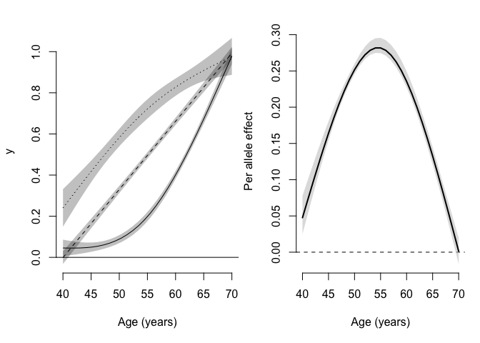

# MRchecks

## Overview

`MRchecks` is a package that performs all the analyses in a forthcoming
paper on how time-varying exposures can bias Mendelian randomization
(MR) analyses. With the functions in this package you can graph and
estimate how the association of a genetic variant with a phenotype
changes with age. If you’re concerned that the association changes
enough that it may bias your MR estimate, there is also a function that
will estimate the potential bias under a number of exposure windows.

## Installation

Installation requires devtools which can be installed with
`install.packages("devtools")`. Once you have `devtools` installed you
can install MRchecks with:

``` r
devtools::install_github("jalabrecque/MRchecks")
```

## Usage

The package comes with a small test data set called `test_data`:

``` r
library(MRchecks)
data(test_data)
```

The data set contains the minimal variables required:

``` r
head(test_data)
```

    ##        age SNP           y           c
    ## 1 54.52100   0 -0.07573056  0.04497838
    ## 2 52.78986   0  0.10594687 -0.02224538
    ## 3 57.25049   2  0.23805736  0.05457459
    ## 4 62.60263   0  1.33247060  0.10780435
    ## 5 65.62173   1  1.08230059  0.22915236
    ## 6 69.62285   1  0.74436273 -0.24542123

An age variable (age), a factor variable with the genetic data (SNP) a
phenotype that will be used as the exposure in the MR analysis (y) and
here, optionally, a covariate is included (c).

We can first use the `SNPxAGE_model` function to fit the model we will
use as the input for the other functions:

``` r
SNPxAGE_model_output <- SNPxAGE_model(data = test_data,
                                      SNP = "SNP",
                                      phenotype = "y",
                                      age = "age",
                                      k = 3,
                                      covars="c")
```

The argument k specifies how many internal knots should be used.

We can plot the relationship between age and the phenotype by genetic
variant as well as a plot of additive genetic effects by age:

``` r
SNPxAGE_plot(SNPxAGE_model_output)
```

<!-- -->

    ## NULL

Looking at the output of this plot we might be concerned that the
genetic association with the phenotype varies enough that bias is a real
concern. Using `SNPxAGE_bias` we can check what the bias would be if all
the MR assumptions hold:

``` r
SNPxAGE_bias(SNPxAGE_model_output,rep = 10,age_set = 66)
```

    ##                     est          se       q025      q975
    ## iv_den65      0.1076253 0.017695563 0.08948791 0.1384105
    ## iv_avg        0.1837739 0.000000000 0.18377389 0.1837739
    ## y5            1.2898014 0.069712954 1.18353034 1.3765784
    ## y10           1.5981528 0.145381375 1.37640694 1.7778295
    ## y25           1.9719371 0.256242953 1.58135797 2.2712877
    ## y5_gauss      1.5396353 0.130007016 1.34142703 1.7012414
    ## y10_gauss     1.9658715 0.236504464 1.60502414 2.2565629
    ## y25_gauss     2.1781173 0.329665383 1.67832382 2.5673733
    ## iv_den_obs    0.2038226 0.005746736 0.19664140 0.2118212
    ## y5_obs        0.9919406 0.006119017 0.98342803 1.0007677
    ## y10_obs       1.0192138 0.014089125 0.99913459 1.0396090
    ## y5_gauss_obs  0.9815818 0.010959892 0.96613161 0.9973391
    ## y10_gauss_obs 1.0085943 0.022134060 0.97827183 1.0409957
