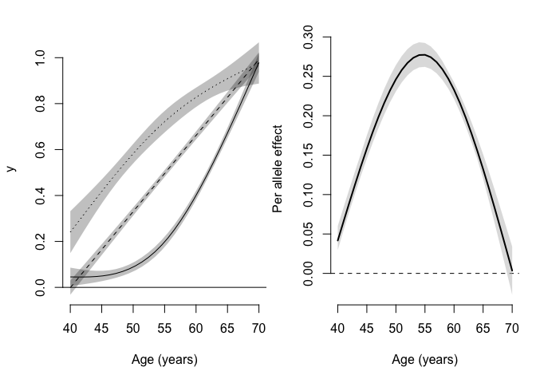

# MRchecks

## Overview

`MRchecks` is a package that performs all the analyses in a forthcoming
paper on how time-varying exposures can bias Mendelian randomization
(MR) analyses. With the functions in this package you can graph and
estimate how the association of a genetic variant with a phenotype
changes with age. If you’re concerned that the association changes
enough that it may bias your MR estimate, there is also a function that
will estimate the potential bias under a number of exposure windows.

## Installation

Installation requires devtools which can be installed with
`install.packages("devtools")`. Once you have `devtools` installed you
can install MRchecks with:

``` r
devtools::install_github("jalabrecque/MRchecks")
```

## Usage

The package comes with a small test data set called `test_data`:

``` r
library(MRchecks)
data(test_data)
```

The data set contains the minimal variables required:

``` r
head(test_data)
```

    ##        age SNP           y           c
    ## 1 54.52100   0 -0.07573056  0.04497838
    ## 2 52.78986   0  0.10594687 -0.02224538
    ## 3 57.25049   2  0.23805736  0.05457459
    ## 4 62.60263   0  1.33247060  0.10780435
    ## 5 65.62173   1  1.08230059  0.22915236
    ## 6 69.62285   1  0.74436273 -0.24542123

An age variable (age), a factor variable with the genetic data (SNP) a
phenotype that will be used as the exposure in the MR analysis (y) and
here, optionally, a covariate is included (c).

### Run model

We can first use the `SNPxAGE_model` function to fit the model we will
use as the input for the other functions:

``` r
SNPxAGE_model_output <- SNPxAGE_model(data = test_data,
                                      SNP = "SNP",
                                      phenotype = "y",
                                      age = "age",
                                      k = 3,
                                      covars="c")
```

The argument k specifies how many internal knots should be used.

### Plotting age-varying genetic associations

We can plot the relationship between age and the phenotype by genetic
variant as well as a plot of additive genetic effects by age:

``` r
SNPxAGE_plot(SNPxAGE_model_output)
```

<!-- -->

    ## NULL

### Plasmode simulation for potential bias

Looking at the output of this plot we might be concerned that the
genetic association with the phenotype varies enough that bias is a real
concern. Using `SNPxAGE_bias` we can check what the bias would be if all
the MR assumptions hold:

``` r
SNPxAGE_bias(SNPxAGE_model_output,rep = 10,age_set = 66)
```

    ##                     est          se       q025      q975
    ## iv_den65      0.1115721 0.014846260 0.09630683 0.1380786
    ## iv_avg        0.1837739 0.000000000 0.18377389 0.1837739
    ## y5            1.2851744 0.060278790 1.19928063 1.3780841
    ## y10           1.5879244 0.125341188 1.40905011 1.7802733
    ## y25           1.9467673 0.216444349 1.63515728 2.2666547
    ## y5_gauss      1.5309052 0.112349259 1.37081301 1.7039276
    ## y10_gauss     1.9485278 0.203458797 1.65779241 2.2596894
    ## y25_gauss     2.1394242 0.274612100 1.74326952 2.5316138
    ## iv_den_obs    0.2085182 0.006455139 0.19870102 0.2174809
    ## y5_obs        0.9903517 0.005084901 0.98564219 1.0002883
    ## y10_obs       1.0158774 0.011498401 1.00156286 1.0363722
    ## y5_gauss_obs  0.9786686 0.009143546 0.97038695 0.9967028
    ## y10_gauss_obs 1.0029113 0.018179919 0.98230468 1.0365301
